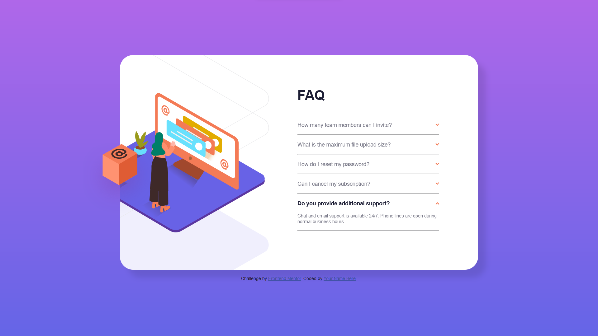

# Frontend Mentor - FAQ accordion card solution

This is a solution to the [FAQ accordion card challenge on Frontend Mentor](https://www.frontendmentor.io/challenges/faq-accordion-card-XlyjD0Oam). Frontend Mentor challenges help you improve your coding skills by building realistic projects.

## Table of contents

- [Frontend Mentor - FAQ accordion card solution](#frontend-mentor---faq-accordion-card-solution)
  - [Table of contents](#table-of-contents)
  - [Overview](#overview)
    - [The challenge](#the-challenge)
    - [Screenshot](#screenshot)
    - [Links](#links)
  - [My process](#my-process)
    - [Built with](#built-with)
    - [Workflow](#workflow)
    - [Tools](#tools)
    - [What I learned](#what-i-learned)
    - [Useful resources](#useful-resources)
  - [Author](#author)

## Overview

### The challenge

Users should be able to:

- View the optimal layout for the component depending on their device's screen size
- See hover states for all interactive elements on the page
- Hide/Show the answer to a question when the question is clicked

### Screenshot



### Links

- [Live Site](https://thabeanboy.github.io/Front-End-Mentor-Faq-Accordion-/)
- [Repo](https://github.com/ThaBeanBoy/Front-End-Mentor-Faq-Accordion-)
- [Front End Mentor](https://www.frontendmentor.io/home)
- [Challenge Page](https://www.frontendmentor.io/challenges/faq-accordion-card-XlyjD0Oam)

## My process

### Built with

- Semantic HTML5
- CSS
- JS
- Visual Studio Code (Code Editor)

### Workflow

- Mobile-first workflow

### Tools

- [Coolors Gradient Maker](https://coolors.co/gradient-maker/dcf180-f0cd97-35518a)

### What I learned

HTML data attributes were useful in this project. I used them for faq elements to represent 2 states, namely 'closed' & 'opened'. It made styling the faq elements easy and editable. The data attributes were also useful in the Javascript portion, because I could easily get the values of the data attributes and change them when necessary.

```html
<div class="faq-element" data-faq-state="closed">
  <h3 class="question">
    Do you provide additional support?
    
  </h3>
  <p class="answer">
    Chat and email support is available 24/7. Phone lines are open during normal
    business hours.
  </p>
</div>
```

```css
.faq-element[data-faq-state='opened'] {
  /* styles */
}

.faq-element[data-faq-state='closed'] {
  /* styles */
}
```

```js
const faqElements = document.querySelectorAll('.faq-element');

faqElements.forEach((element, index) => {
  element.addEventListener('click', () => {
    const elementIndex = index;
    const state = element.getAttribute('data-faq-state');
    element.setAttribute(
      'data-faq-state',
      state === 'opened' ? 'closed' : 'opened'
    );

    /*
      Logicially speaking, if the state is 'closed', that must mean the user is trying to open an faq element
      If the user is trying to open, then every other faq element must be closed
    */
    if (state === 'closed') {
      faqElements.forEach((elmnt, indx) => {
        if (indx !== elementIndex) {
          elmnt.setAttribute('data-faq-state', 'closed');
        }
      });
    }
  });
});
```

### Useful resources

- [Coolors Gradient Maker](https://coolors.co/gradient-maker/dcf180-f0cd97-35518a) - This helped me make the background gradient.

## Author

- Github -[@ThaBeanBoy](https://github.com/ThaBeanBoy)
- Frontend Mentor - [@ThaBeanBoy](https://www.frontendmentor.io/profile/ThaBeanBoy)
- Instagram - [@tiin_giib_chiip](https://www.instagram.com/tiin_giib_chiip/)
